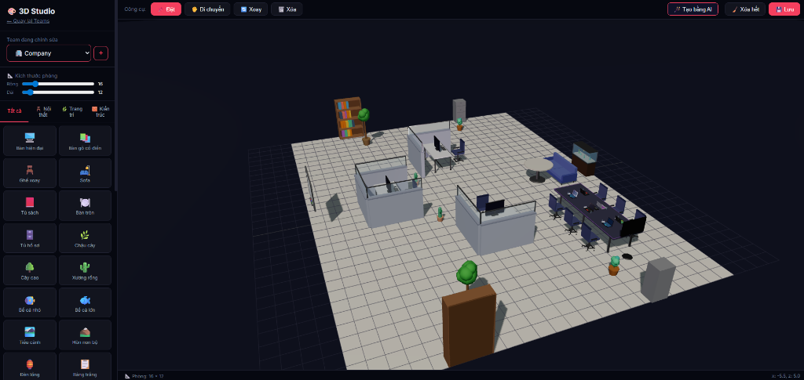
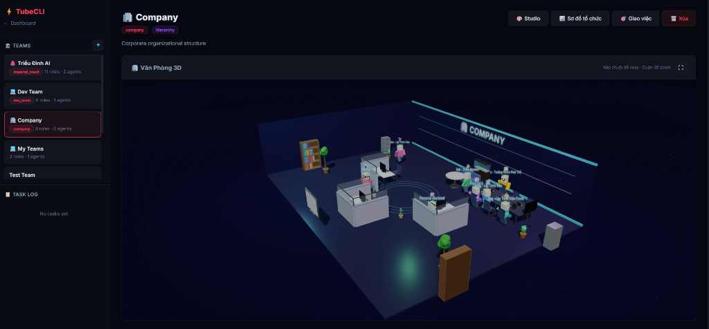

# ⚡ ZhiYing — Open Source AI Agent CLI System

<p align="center">
    <a href="https://github.com/tubecreate/zhiying">
        
    </a>
    <a href="https://github.com/tubecreate/zhiying">
        
    </a>
    <a href="https://github.com/tubecreate/zhiying/blob/main/LICENSE">
        
    </a>
</p>

<p align="center">
    
    
    
    
</p>

<p align="center">
    
    
    
</p>

A headless CLI system for installing, managing, and orchestrating **AI agents**, **skills**, and **workflows**. Designed so that AI agents can understand, install, and operate the entire system autonomously.


<br>


## 🌟 Key Features

The system has evolved into a full-fledged 10-subsystem architecture:

- 🤖 **Agent Manager** — Create and manage AI agents with personas, routines, and skills.
- ⚡ **Skill System** — Executable workflows marked with tags (Workflow, API, Markdown) featuring a Markdown Viewer and Real-time Execution Modal.
- 🔄 **Workflow Engine & Builder** — DAG-based workflow executor. The WebUI features a modern node-based builder with compact nodes, contextual sliding property panels, and dynamic model selection (Ollama local / Cloud API).
- 🎨 **Web Dashboard** — Comprehensive SPA (Single Page Application) at `localhost:5295/dashboard` to visually manage agents, workflows, skills, marketplace, settings, and monitor browsers natively.
- 👥 **Teams Agents** — Orchestrate multiple agents using Organizational Charts. Assign roles via logical templates or drag-and-drop. Task Delegation routes work through the team based on sequential, parallel, or hierarchical strategies.
- 🏢 **3D Studio (Teams 3D)** — Isometric procedural 3D visualization using Three.js. Supports multi-seat furniture (meeting tables, conference tables) with intelligent inward-facing algorithms, raycasting group manipulation, and 15+ built-in assets.
- 🎬 **Story Engine & Player** — Generate interactive 3D stories from prompts via our Script Editor. Agents communicate via 3D speech bubbles inside an animated scene player.
- 🔌 **Extension Manager** — Pluggable architecture supporting `browser`, `webui`, `market`, and `studio3d`. Enables hot-reloading CLI commands and API routes.
- 🌐 **Browser Automation** — Orchestrate browser profiles, proxies, fingerprints. Built-in Auto-Login for Google with TOTP 2FA.
- 🛒 **Marketplace** — Discover, install, and share community skills via an online registry.

## 🚀 Quick Start & Installation

### Prerequisites
- Python 3.9+
- Ollama (Optional, required for local AI execution)
- Git

### 1. Clone & Install
```bash
git clone https://github.com/tubecreate/zhiying.git
cd zhiying
pip install -e .
```

### 2. Initialize Workspace
Run the initialization command to setup the `data/` directory, extract default skills, and activate core extensions.
```bash
zhiying init --lang vi
```

### 3. Start the Web Dashboard
After initialization, start the API server to access the GUI.
```bash
zhiying api start --port 5295
```
Open your browser and navigate to: **http://localhost:5295/dashboard**

## 💻 CLI Usage

Manage the entire system directly from the terminal if you prefer a headless approach:

### Agent Management
```bash
zhiying agent create "My Assistant" --description "General purpose AI agent"
zhiying agent list
zhiying agent show <id>
zhiying agent delete <id>
```

### Skill Execution
```bash
zhiying skill list
zhiying skill run "AI Summarizer" --input "Long text content..."
```

### API & Workflows
```bash
zhiying api start --port 5295
zhiying api stop
zhiying workflow run <path_to_workflow.json>
```

### Extensions & Market
```bash
zhiying extension list
zhiying extension enable webui
zhiying market search "seo"
zhiying market install "seo-analyzer"
```

## 🧠 Architecture Overview

```
zhiying/
├── zhiying/           # Main package
│   ├── api/           # REST API server (FastAPI)
│   ├── cli/           # CLI command modules
│   ├── core/          # Core Business logic
│   ├── extensions/    # Extensions (Browser, WebUI, Market, Studio3D)
│   ├── nodes/         # Workflow Node implementations
│   └── skills/        # Built-in system skills
├── .agents/           # AI-readable documentation (SKILL.md)
├── data/              # Runtime DB & State (gitignored)
└── tests/             # Test suite
```

## 📖 AI-Readable Documentation
The `.agents/` and skills folders contain documentation crafted explicitly for LLMs (`SKILL.md`). External AI agents (like Claude or GPT-4) can read these files to learn how to operate the ZhiYing system, write plugins, and debug workflows completely autonomously without human intervention.

## 📝 License
MIT License - Made with 🤖 by TubeCreate Team
